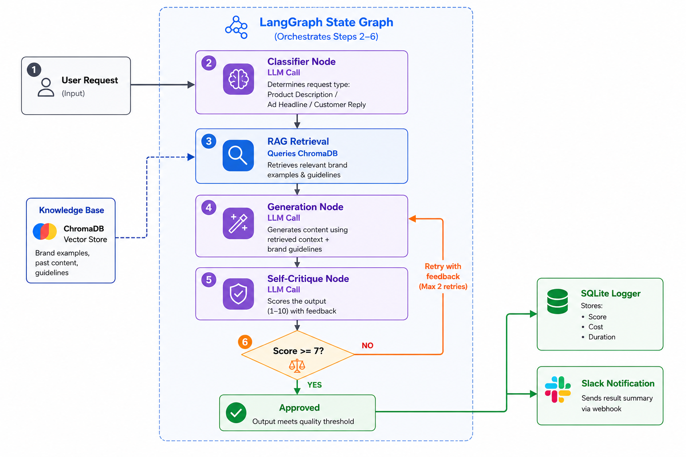

# Autonomous Marketing Content Agent

A multi-task AI agent that classifies incoming marketing requests, generates brand-grounded content using RAG, critiques its own output, retries automatically on low quality, and logs cost/performance on every run — built with LangGraph, Groq, and ChromaDB.

## What it does

Instead of a single-purpose "generate text" script, this agent handles **three different marketing tasks** through one pipeline:

- **Product descriptions** — new product copy grounded in past brand examples
- **Ad headlines** — short, punchy campaign headline variants
- **Customer replies** — warm, on-brand responses to customer messages/complaints

The agent decides which task type it's dealing with on its own — no manual tagging required.


## How it works

```
Request → Classify → Retrieve (RAG) → Generate → Self-Critique → Retry if weak → Log + Notify
```

1. **Classify** — an LLM call determines whether the input is a product description, ad headline, or customer reply request
2. **Retrieve** — relevant past brand content is pulled from a ChromaDB vector store using semantic similarity, so output stays on-brand instead of generic
3. **Generate** — content is written using the retrieved context, task-specific prompt template, and brand guidelines
4. **Self-Critique** — a second LLM call scores the output (1–10) against brand tone, clarity, and requirements
5. **Retry** — if the score is below threshold, the agent regenerates automatically using the critique's feedback (capped at 2 retries, then flagged for human review)
6. **Log & Notify** — every run (input, output, score, attempts, duration) is saved to SQLite, and approved content is pushed to Slack via webhook

The pipeline is orchestrated as a **LangGraph state graph** — nodes for each step, with a conditional edge that loops back to generation on a failed critique.

## Tech stack

- **LangGraph** — agent orchestration (state graph, conditional routing)
- **LangChain** — LLM/embedding integration
- **Groq (Llama 3.3 70B)** — generation and critique
- **ChromaDB + HuggingFace embeddings** — RAG vector store (local, free)
- **SQLite** — run logging and performance tracking
- **FastAPI** — webhook endpoints (`/generate`, `/generate-batch`, `/stats`)
- **Streamlit** — interactive dashboard (single request, batch run, stats)
- **Slack Incoming Webhooks** — notifications on approved content

## Project structure

```
marketing-agent/
├── data/
│   ├── brand_data.py        # brand examples + tone guidelines
│   └── sample_products.py   # sample batch inputs
├── src/
│   ├── retrieval.py         # ChromaDB vector store + RAG retrieval
│   ├── classifier.py        # task-type classification
│   ├── task_prompts.py      # prompt templates per task type
│   ├── generate.py          # LLM generation
│   ├── critique.py          # self-critique scoring
│   ├── agent_graph.py       # LangGraph orchestration (main pipeline)
│   ├── logger.py            # SQLite logging + stats
│   └── notifier.py          # Slack webhook integration
├── main.py                  # FastAPI app
├── dashboard.py             # Streamlit UI
└── requirements.txt
```

## Running it

```bash
# setup
python -m venv venv
venv\Scripts\activate
pip install -r requirements.txt

# add your keys to .env
GROQ_API_KEY=your_key_here
SLACK_WEBHOOK_URL=your_webhook_url_here

# run the agent directly (CLI test)
python -m src.agent_graph

# run the API
uvicorn main:app --reload
# → visit http://127.0.0.1:8000/docs

# run the dashboard
streamlit run dashboard.py
```

## Example runs

**1. Product description**

**Input:** `"Rosehip Oil Face Serum, cold-pressed rosehip oil, fades dark spots and improves skin texture"`

**Detected type:** `product_description`

**Output:**
> "Rosehip Oil Face Serum: 100% cold-pressed rosehip oil, rich in 0.5% trans-retinoic acid, fades dark spots and improves skin texture by promoting cell turnover and collagen production. Regular use of this serum results in a more even-toned complexion within 4-6 weeks."

**Score:** 9/10 · **Status:** APPROVED · **Attempts:** 1

---

**2. Ad headline**

**Input:** `"Promote our Black Friday sale on the entire skincare line"`

**Detected type:** `ad_headline`

**Output:**
> 15% Vitamin C, now on sale
> Niacinamide 10% sale starts Friday
> Glycolic 7% products discounted

**Score:** 8/10 · **Status:** APPROVED · **Attempts:** 1

---

**3. Customer reply**

**Input:** `"Customer says the moisturizer broke them out, they want a refund"`

**Detected type:** `customer_reply`

**Output:**
> "We apologize for the reaction you experienced with the moisturizer. We take this seriously and would like to process your refund immediately — please reply with your order number and we'll take care of it within 24 hours."

**Score:** 8/10 · **Status:** APPROVED · **Attempts:** 1

---

**4. Retry in action** (low initial score triggered an automatic regeneration)

**Input:** `"Argan Oil Hair Serum, 100% pure argan oil, tames frizz and adds shine"`

**Detected type:** `product_description`

**Attempt 1:** scored below threshold on brand tone match → agent regenerated using the critique feedback

**Final output (attempt 2):**
> "Argan Oil Hair Serum: 100% pure argan oil tames frizz and adds shine, leveraging its high oleic acid content to smooth and protect the hair cuticle."

**Score:** 8/10 · **Status:** APPROVED · **Attempts:** 2

## What makes this "agentic" rather than a script

- **Autonomous decision-making** — the agent classifies task type and decides whether to retry, not hardcoded branching per input
- **Tool use** — calls out to embeddings/vector search, an LLM, Slack, and a database as part of its execution
- **Self-evaluation loop** — the agent critiques and corrects its own output before it's considered "done"
- **Observability** — every run's cost/quality/duration is tracked, enabling future optimization (e.g., routing simple tasks to cheaper models)

## Possible extensions

- Model routing by task complexity (cheap model for simple replies, stronger model for nuanced ones) to cut token cost further
- Persistent self-optimization — using logged accept/reject history to auto-tune prompts over time
- Multi-brand support — swap the vector store per brand for true multi-tenant use